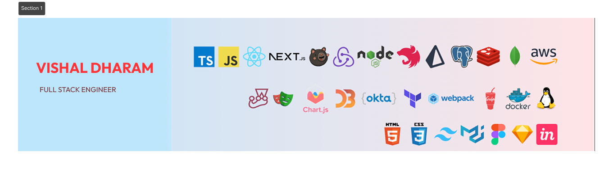

<h1 align="center">Hey there 👋, I'm Vishal Dharam</h1>  
<h3 align="center">A passionate Full Stack Engineer from India</h3>

💻 Passionate about building scalable and efficient web applications.  
📍 Based in Bangalore | Currently at **Bezt Labs**  
📬 Contact me: [vishal.dharam20@pccoepune.org](mailto:vishal.dharam20@pccoepune.org)

---

## 📌 About Me

### 🎓 Education:
- **B.E in Computer Engineering** | PCCOE, Pune  
- **Diploma in Computer Engineering** | MSBTE  

### 🌱 Currently Learning:
- Advanced AI/ML  
- Cloud Computing  
- Performance Optimization  

### 💡 Tech Interests:
- Web Development | Backend & Frontend  
- Scalable API Design  
- System Architecture  
- Distributed Systems  

---

## ⚙️ Tech Stack

### 🚀 Languages & Frameworks:
- **Languages:** C++, JavaScript, Java, Python, TypeScript, PHP, C, HTML, CSS  
- **Frontend:** React.js, Next.js, Redux, Tailwind CSS, Bootstrap, Figma  
- **Backend:** Node.js, NestJS, Express.js, CodeIgniter 5  
- **Databases:** PostgreSQL, MongoDB, MySQL, Firebase, Amazon S3, ElasticSearch, PrismaORM  
- **Tools:** Postman, Redis, Docker, Git, WebSockets  
- **AI & DSA:** ChatGPT, LeetCode, GeeksForGeeks, HackerRank, CodeNinjas  

---

## 💼 Work Experience

### 🔹 **Bezt Labs** | Full Stack Developer (Oct 2024 - Present | Bangalore)
- Built scalable APIs using TypeScript, NestJS & Node.js.  
- Designed and optimized database schemas with PostgreSQL & PrismaORM.  
- Developed responsive UI for web and mobile apps using Next.js.  
- Implemented SSR & SSG for improved performance and SEO.  

### 🔹 **Origin Software Solutions** | Full Stack Intern (Sep 2023 - Sep 2024 | Kopargaon)
- Developed and maintained MERN stack applications.  
- Migrated state management to Redux for better scalability.  
- Integrated Redis caching to optimize backend performance.  
- Worked in Agile teams, contributing to code reviews and sprint planning.  

---

## 🚀 Projects

### 📌 **VIBECHAT** | Chat App
🔗 [GitHub](https://github.com/vishaldharam20/VIBECHAT)  
**Tech:** React.js | Context API | WebSockets | Node.js | Redis  
**Features:** One-to-one & group chats with resource sharing and optimized WebSockets for minimal load time.  

### 📌 **INTERNLINK** | Internship & Job Portal (In Development)
🔗 [GitHub](https://github.com/vishaldharam20/INTERNLINK)  
**Tech:** React | Redux Toolkit | Node.js | Redis  
Built a platform for job & internship applications with integrated candidate testing.  

### 📌 **SANGAMBHARAT** | E-commerce Platform
🔗 [Live App](https://sangambharat.com)  
**Tech:** Next.js | Node.js | JWT Tokenization | Payment Gateway  
**Features:** Secure product transactions, ElasticSearch-powered product search, and JWT tokenization for security.  

---

## 🏆 Awards & Achievements

- 🏅 **CII Award 2023** - Top 2/10,000  
- 🏅 **Blueconch XBUS Award 2023** - Top 8/2,000  
- 🏅 **Dipex 2022** - 1st Place among 500 participants  

---

## 📫 Connect With Me

🔗 [GitHub](https://github.com/vishaldharam20)  
🔗 [LinkedIn](https://linkedin.com/in/vishal-dharam)  
🔗 [GeeksForGeeks](https://auth.geeksforgeeks.org/user/vishaldharam20)  
🔗 [Twitter](https://twitter.com/vishaldharam21)  
